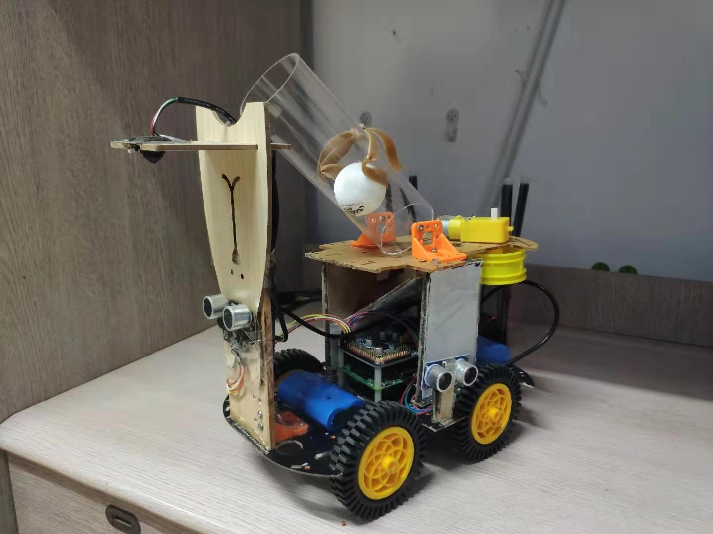

# Mobile-Rover-Design
The goal of this project is to design and assemble a automatic mobile rover to accomplish prescribed tasks including line tracing, color matching, ultrasonic rangingradar navigation, manipulator design, wireless communication etc. The major hardwares we use include Raspberry Pi, mbed, FGPA, camera, DC motor; and the software is mainly implemented in python and C.  

Demo
----

- You can check all the technical details in the Presentation PPT and Report.
- A demo video is given in the following link: https://1drv.ms/v/s!AkjrmpmTAjM7il0ZQKDkDaLx31DQ.

COPYRIGHT
-----------------------------------------------------------

    Copyright 2019, 2019 Table-mining group
    Contact: arnold981017@gmail.com

    you can redistribute our method and/or modify
    it under the terms of the MIT License as published 

    our method is distributed in the hope that it will be useful,
    but WITHOUT ANY WARRANTY; without even the implied warranty of
    MERCHANTABILITY or FITNESS FOR A PARTICULAR PURPOSE.  See the
    MIT License for more details.

